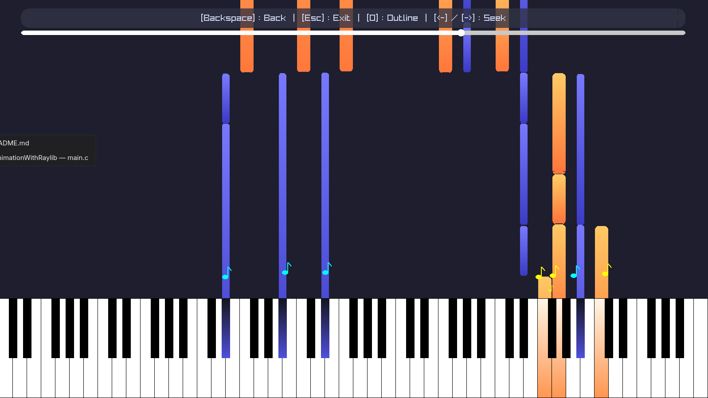

# Raylib Piano MIDI Animation
A MIDI visualizer built in C using Raylib. Loads a MIDI file that has been converted to CSV, drops note blocks down onto a piano, and plays back synthesized audio as it hits, also with "seek"ing support.


---

## Features

- Falling note blocks, which are notes that spawn above the piano and fall in time with the music
- Live piano keyboard with keys that change color when pressed
- Real-time audio as a sine-wave voice synthesis with logarithmic decay, up to 32 simultaneous voices
- Seek control, you can move forward/backward through the song with arrow keys
- Note particles, they're musical note symbols that float up from the piano on each hit
- Dual render mode, you can toggle between filled and outline

---

## Repo Structure

```
.
├── assets/midis/output.csv     # midi data consumed by the app
├── midi-to-csv/                # python utility to convert .mid to .csv
│   ├── input.mid
│   ├── main.py
│   └── requirements.txt
├── src/
│   ├── audio/                  # audio stream, voice synth, frequency tables
│   ├── core/                   # app entry point and main loop
│   ├── graphics/               # bresenham line/rect, midpoint circle/ellipse
│   ├── objects/                # piano, note block, note particle, midi parser, slider
│   ├── render/                 # render mode state (filled and outline)
│   ├── screens/                # menu, anim, objects, about screens
│   └── utils/                  # color palette, draw_utils, screen types
├── build/app                   # compiled binary output
└── Makefile
```

---

## Dependencies

- [Raylib 5.5](https://www.raylib.com/)
- GCC
- Make

additions, only needed if you want to convert your own midi file
- Python 3
- Dependencies in `midi-to-csv/requirements.txt`

---

## Build & Run

```bash
# build
make

# run
./build/app
```

---

## Converting a Custom MIDI File

if you want to use your own midi file

```bash
cd midi-to-csv
pip install -r requirements.txt
python main.py          # reads input.mid, writes output.csv
cp output.csv ../assets/midis/output.csv
```

---

## Screens

- **Menu**
- **Animation**, that is a full midi playback with falling notes and piano animations
- **Objects**, that is a screen where you can inspect individual components (piano, note block, midi slider, note particle)
- **About**, my infos
